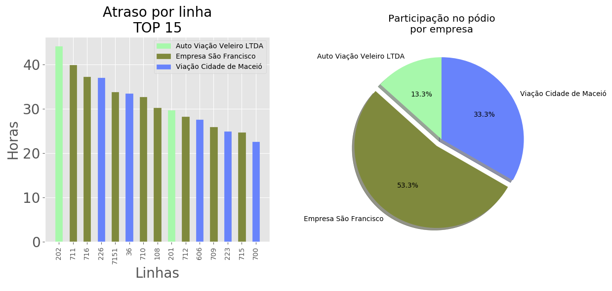
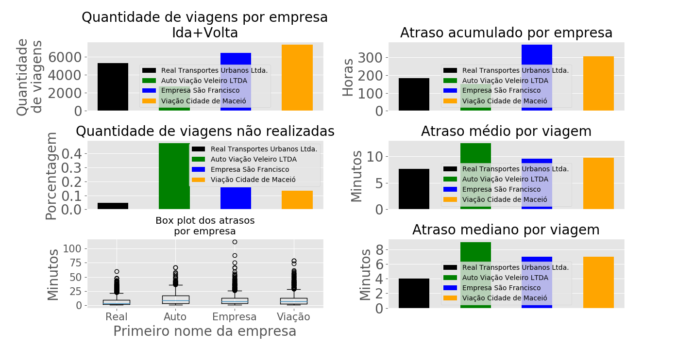

# MiniProjeto SMTT

[![NPM Version][npm-image]][npm-url]
[![Build Status][travis-image]][travis-url]
[![Downloads Stats][npm-downloads]][npm-url]

Projeto desenvolvido como seleção para estágio na SMTT. O desafio é ler um conjunto de dados e apresentar ele da melhor forma, para tomadas de decisão. O projeto desenvolvido aqui é capaz de resumir duas váriaveis, que são Empresa e Atraso. As funções estão separadas em dois arquivos independentes.

## Instalação dos requisitos

OS X & Linux:

```sh
sudo apt-get update
sudo apt-get install python-pip
pip3 install pandas
pip3 install numpy
pip3 install matplotlib
```

## Como usar

Temos dois arquivos independentes, portanto basta executar um por vez, e os gráficos serão gerados.

```sh
python3 atraso_resumo.py
python3 empresa_resumo.py
```

## Exemplo de gráficos gerados

# Resumo dos atrasos


# Resumo das empresas


## Meta

Eduardo Gomes – egsantos128@gmail.com

[https://github.com/eduardoGo/miniprojeto_smtt](https://github.com/eduardoGo/)

[npm-image]: https://img.shields.io/npm/v/datadog-metrics.svg?style=flat-square
[npm-url]: https://npmjs.org/package/datadog-metrics
[npm-downloads]: https://img.shields.io/npm/dm/datadog-metrics.svg?style=flat-square
[travis-image]: https://img.shields.io/travis/dbader/node-datadog-metrics/master.svg?style=flat-square
[travis-url]: https://travis-ci.org/dbader/node-datadog-metrics
[wiki]: https://github.com/seunome/seuprojeto/wiki
